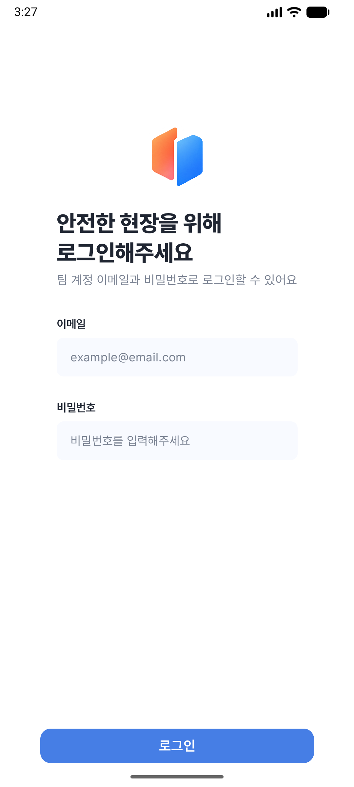

# HeartGuard 기능 수정 및 회귀 검증

검증일: 2026-10-04 (Asia/Seoul). 대상: Android 작업자 앱, Debug 빌드.
이 보고서는 이번 실행의 결과만 기록한다. 이전 실서버 성공을 이번 성공으로 계산하지 않는다.

## 코드 변경

| 요청 | 적용 내용 | 이번 검증 |
|---|---|---|
| 저장 결과·응답 유실 | 성공 envelope와 유효한 recordId 검증. 결과 불명 제출은 동일 의도로 업로드·POST를 재실행하지 않음 | 단위·계측 PASS |
| 앱 종료·재로그인 뒤 중복 방지 | 서버·계정별 AtomicFile 제출 표식. 본문·사진·토큰은 저장하지 않음 | 파일 재생성·계정 분리·동시 begin·손상·최초 쓰기 중단 계측 PASS |
| HTTP 자동 재전송 | 기록 POST 전용 연결 재시도·리다이렉트 차단 및 one-shot 본문 | 408·503·307·308·응답 연결 종료 시 실제 POST 1회, 세션 불일치 0회 PASS |
| 호출 취소 후 재진입 | flow/session/callId 검사, 종료 시 Job·효과 정리, RESUMED 화면만 효과 수집 | 지연 PATCH·등록·이전 효과 무효화·20회 반복·종료된 등록 응답 후 새 의도 단위 PASS |
| 취소 버튼 | 기존 Figma 패치의 테마 테두리·surface 적용 | 빌드·리뷰 PASS; 실제 관리자 연동 미검증 |
| 키보드·확대 글꼴 | IME 표시 시 로그인·탈퇴 폼과 액션 전체 스크롤, 입력 오류 문구 분리, 포커스 입력칸 전체 자동 노출 | 기존 실패 2건 포함 전체 UI PASS. 입력·숨김·재열기·포커스·전체 경계 PASS |
| 앱 내부 로고 | 제공 PNG를 nodpi 리소스로 교체, 80dp Fit·투명도·색상 유지 | 원본 SHA-256 일치, 설치 앱 로그인 화면 시각 PASS |
| 남은 응답 검증 패치 | 알림·내역·홈·호출·문의·프로필 변경의 success/error/data 검증 | 실제 Retrofit→RemoteDataSource 응답 조합 70개 PASS |

성공인데 로컬 표식 정리에 실패하면 서버 저장 성공은 유지하고 별도 경고와 로컬 정리 재시도를 제공한다. 이때 프로세스가 종료되면 메모리의 성공 사실을 잃어 표식이 미확정으로 남을 수 있다. 이전 제출을 재전송하지 않는 보수적 정책이며, 서버의 멱등 키·제출 ID 조회 계약은 아직 확인되지 않았다.

HTTP 200 명시 거절의 코드는 보존하지만 기존 HTTP 상태 기반 화면별 충돌 복구와 안내를 그대로 사용하는 곳에서는 일반 실패로 표시할 수 있다. 서버가 해당 코드를 200으로 반환하는지는 계약 확인이 필요하다.

정상 빈 목록, current 호출의 NONE/callId=null, 비밀번호 변경의 success=true/data=null 호환 동작을 유지한다. Unit 응답인 로그아웃·회원탈퇴는 필수-data 검증을 적용하지 않았다.

## 구현 흐름·주입·수명

- 저장: Screen 이벤트 → RecordDraftViewModel → SubmitFieldRecordUseCase → RecordRepository → RemoteDataSource → Retrofit → envelope 검증 → 결과 상태. POST 전에 별도 RecordSubmissionRepository가 AtomicFile 표식을 기록한다.
- 호출: Route → EmergencyViewModel → UseCase → Repository → RemoteDataSource. 비동기 결과는 흐름·세션·호출을 대조하고, 종료/reset 시 등록·PATCH·폴링 Job을 취소한다.
- Hilt: RecordSubmissionRepository→RecordSubmissionRepositoryImpl, RecordSubmissionLocalDataSource→RecordSubmissionLocalDataSourceImpl을 기존 RecordDataModule에 @Binds로 연결했다. LocalDataSource 구현은 @Singleton이며 IO dispatcher와 Mutex로 파일 접근을 직렬화한다. 기존 RecordApiService @Provides에만 단일전송 옵션을 적용했다.
- 메모리: 로컬 저장소는 ApplicationContext에서 File을 얻으며 화면 객체를 보관하지 않는다. 입력칸 requester·포커스·스크롤 상태는 composition 수명이고 LaunchedEffect가 포커스/IME 변경·화면 제거 때 취소된다. 새 Activity·View·NavController의 장기 참조는 없다.
- BuildConfig 필드·서버 주소·의존성·모듈 구조는 변경하지 않았다. 저장 파일의 서버별 분리는 기존 BASE_URL을 사용한다.

## 실행 결과

명령:

```sh
./gradlew :app:testDebugUnitTest :app:assembleDebug :app:lintDebug
./gradlew :app:connectedDebugAndroidTest
```

- 전체 단위 테스트: **276개, 실패·오류 0개**. 기존 206개와 마지막 응답 회귀 70개 포함.
- 전체 계측 테스트: **32개, 실패·오류 0개**. 호출·로고·IME·기록 변경을 합친 UI 단계에서 전체 실행했다.
- 마지막 변경은 RemoteDataSource 응답 검증이며, 그 뒤 단위·Debug 빌드·lint를 다시 실행했다.
- Debug APK 빌드 성공. Lint 오류 0개·경고 52개.
- 변경별 비판적 리뷰 수행. 최종 응답 검증 리뷰에서도 확인된 Critical·Warning은 없었다.

원본 XML은 빌드 출력에 있다: `app/build/test-results/testDebugUnitTest/`, `app/build/outputs/androidTest-results/connected/debug/`. 재실행 시 덮어써질 수 있다.

## 기능별 검증 범위와 남은 조건

| 영역 | 이번 PASS 범위 | 미실행·차단 범위 |
|---|---|---|
| 인증·세션 | 토큰/세션 전환·지연 응답·초안 정리 단위, 로그인 레이아웃·IME 계측 | 실서버 로그인·자동 로그인 실기기 E2E BLOCKED |
| 홈·타임라인 | DTO/mapper·스케줄·조회 응답 계약 단위 | 실서버 null 표시·복귀 갱신·전화 다이얼러 NOT_RUN |
| 사진·온도·작업·휴식 | 업로드 계약·기록 제출·REST 경계·자정·초안·저장 결과·복원 테스트 | 실제 CameraX·앨범 권한/취소·실서버 사진/작업/휴식 저장 NOT_RUN |
| 내역·상세 | 날짜/필터·페이징·매핑·초안 UI·응답 검증 | 실서버 새 기록/상세 사진 대조 NOT_RUN |
| 긴급호출 | 상태 전이·409 재조회·폴링·세션·지연 응답·20회 효과 경쟁 단위 | 실제 오버레이 취소→재진입 20회, 관리자 확인/종료 E2E BLOCKED |
| 알림 | 필터/페이징·읽음 실패·지연 응답 단위, 목록 UI 계측, 응답 계약 | 실제 기록/긴급/답변 알림의 동일 resourceId 대조 BLOCKED |
| 문의 | 등록/목록 계약·페이징·오류 단위 | 실제 문의→관리자 답변→알림 E2E BLOCKED |
| 프로필·비밀번호 | API/Repository·충돌·변경 응답 검증 단위 | 실서버 변경·복원 NOT_RUN |
| 오프라인·연타 | Network·취소·세대/동시성·중복 제출 대역 테스트 | 실제 기기 네트워크 전환 E2E NOT_RUN |
| 회원탈퇴 | 안내·입력·동의·IME·오류 계측, Repository 대역 | 실제 팀 탈퇴는 승인 범위 밖, 실행하지 않음 |

서버 기준 기상값이 필요한 WORK/REST 성공은 이번 실행에서 확인하지 못했다. 과거 WEATHER_BASELINE_REQUIRED 결과는 현재 서버 상태의 증거로 사용하지 않는다.

실서버 테스트 로그인은 자동 승인 검토가 지정 URL로 자격 증명을 보내는 승인이 명확하지 않다는 이유로 **요청 실행 전에 차단**했다. 사용자에게 README 테스트 서버 `https://heatguard-temp.https.gsmsv.site/` 로그인 승인을 요청했다. 이번 실서버 인증 요청은 전송하지 않았다. 관리자 웹 URL과 관리자 협력도 아직 없어 관리자 E2E를 PASS로 표시할 수 없다.

## 키보드 환경과 증거

AVD `test` (Android 17/API 37, arm64)에서 물리 키보드를 끄고 cold boot한 뒤 Android 설정 검색창의 실제 소프트 키보드 표시를 먼저 확인했다. 기존 show_ime_with_hard_keyboard 설정만으로는 실패했던 환경과 구분한다. 이후 실제 IME에서 UI 결함을 재현하고 수정했다. 테스트 timeout 증가나 필수 입력칸 경계 assertion 삭제는 하지 않았다.

검증 뒤 AVD 설정 파일의 물리 키보드 값과 show_ime_with_hard_keyboard 값을 원래대로 복원했다. 이미 부팅된 테스트 인스턴스의 하드웨어 설정은 다음 재부팅부터 적용된다.

로그인·오류·탈퇴 액션은 IME 표시 시 개별 스크롤로 도달 가능해야 한다. 동시에 모두 보이는 기대 대신 각 노드를 스크롤 후 검증하며, 입력칸 전체 경계와 포커스 검사는 유지·강화했다.



제공 PNG와 nodpi 리소스의 SHA-256:

`14714aac0c7a88b838792be6af3fa6d893b1876804f65aba7c28644725e5cb42`

## GitHub 및 적용 순서

기존 미커밋 변경은 [PR #99](https://github.com/team-nativeLab/heatguard-Android/pull/99)와 [PR #101](https://github.com/team-nativeLab/heatguard-Android/pull/101)에 별도로 보존했다.

앱 변경은 의존 브랜치로 연결되어 있다. 모두 Draft이며 병합하지 않았다.

1. [PR #103](https://github.com/team-nativeLab/heatguard-Android/pull/103): 기록 제출 안전성, Issue #102.
2. [PR #105](https://github.com/team-nativeLab/heatguard-Android/pull/105): 호출 재진입·취소 버튼, Issue #104.
3. [PR #106](https://github.com/team-nativeLab/heatguard-Android/pull/106): PNG 로고·IME, 기존 Issue #58 일부.
4. Issue #107: 남은 API 응답 검증·이 보고서. 최종 PR은 게시 후 README에 연결한다.

후속 PR은 선행 변경을 포함하므로 위 순서로 검토·적용해야 한다. 성공/차단/미실행 범위를 구분하며, 관리자 E2E가 필요한 Issue를 전체 완료로 닫지 않는다. AGENTS·SKILL 규칙 파일은 이번 앱 수정에서 편집하지 않았다.
